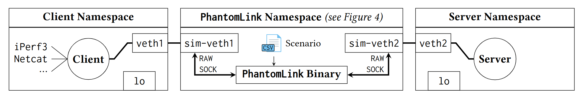
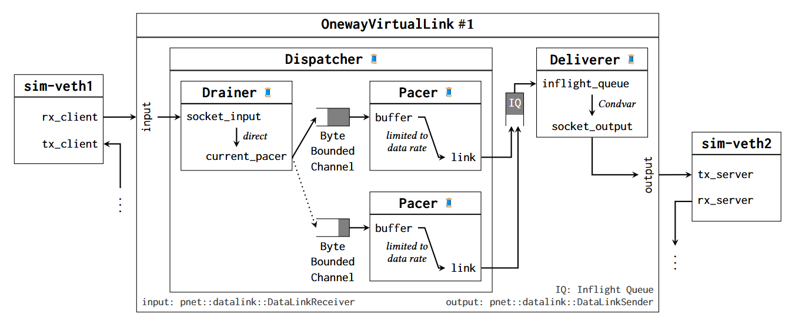

<p align="center">
  
</p>

<p align="center">```phantomlink``` looks like a multi-hop Internet path but emulates a virtual end-to-end link</p>

<p align="center">
    <a href="https://www.rustup.rs"></a>
    <a href="https://depend.cs.uni-saarland.de/"></a>
</p>

```phantomlink``` is a tool for studying the impact of a dynamic network environment on the performance of internet protocols and applications. Written in safe Rust, the tool makes use of Linux network namespaces and virtual Ethernet devices to simulate a realistic end-to-end link. Using simple `.csv` scenario files, it is possible to define the time-evolving virtual link parameters, including delay, data rate over time, and route changes.
Since the tool just opens two connected vEth in different namespaces, it is possible to combine ```phantomlink``` with any application, such as the well-known tools like netcat or iperf but also your own custom application.
With the ability to reorder, delay, pace, and drop packets, ```phantomlink``` can be used to test network behavior under various scenarios.

## 🔥 Features

- **connect** two Linux network namespaces over a **dynamic virtual link**
- specify **bottleneck data rate**, **link delay**, and **packet reordering**
- set the virtual link behavior with a **simple input file format**
- **support** for **all protocols** using ethernet frames ➡️ just route the traffic to ```phantomlink```

## 🔍 Structure of ```phantomlink```

### Input Format

```phantomlink``` runs on scenario files—simple `.csv` files that contain the (time-evolving) parameters of the virtual end-to-end link. This format is motivated by the actual physical variability that an end-to-end connection can be exposed to.
Scenario files define the behavior of the virtual link over time, with parameters such as delay and data rate evolving throughout the experiment.
The `RouteID` column indicates whether there is an actual route change or only updated parameters for the current route.
```phantomlink``` is agnostic of how the scenario file was created and whether the values are realistic. Users can create hand-crafted, synthetic scenarios or use output from any (orbital) dynamics simulator to perform systematic.
Parameters are updated at specified times, creating a step function of changes. For example given the following table:

| Time [ms] | RouteID | Delay [ms] | Btldr [Mbps] |
|-----------|---------|------------|--------------|
| 0         | 0       | 41.0       | 80.0         |
| 11 000    | 0       | 41.2       | 80.2         |
| 23 000    | 1       | 37.0       | 100.0        |
| 40 000    | 1       | 36.7       | 101.5        |
| 60 000    | 1       | 37.0       | 100.1        |

- From `t = 0 ms`, a route with a one-way delay of `41.0 ms` and a data rate of `80.0 Mbit/s` is used.
- At `t = 11 s`, values are updated to `41.2 ms` and `80.2 Mbit/s`.
- At `t = 23 s`, the route changes, as indicated by a new `RouteID`.

### Architecture

<p align="center">
  
</p>

At its core, the ```phantomlink``` toolchain has a binary that operates in conjunction with Linux network namespaces and virtual Ethernet devices.
The toolchain architecture consists of three network namespaces created with `netns`:
- Client Application Namespace
- PhantomLink Binary Namespace
- Server Application Namespace

The client and server namespaces are interconnected with the PhantomLink namespace using two virtual Ethernet devices, resulting in four virtual interfaces. For each virtual Ethernet device:
- One side is moved to the PhantomLink namespace (`sim-veth`)
- The other side is moved to the client or server namespace (`veth`)

After moving the interfaces, MAC and IP addresses are assigned. For each namespace except for the PhantomLink namespace:
- A loopback device is added
- `veth` is configured as the default route to enable traffic flow towards ```phantomlink```

To allow traffic to flow from the client to the server namespace and vice-versa, the ```phantomlink``` binary forwards packets between the two (`sim-veth`) interfaces. This enables applications in the client or server namespace to send and receive traffic over the emulated virtual end-to-end link that evolves according to the scenario file.

### Core Binary

<p align="center">
  
</p>

The ```phantomlink``` binary is implemented in safe Rust to benefit from Rust’s performance and memory safety. The internal binary structure is depicted in the picture above.

1. **Namespace and Raw Sockets**:
   - ```phantomlink``` is started in the PhantomLink namespace.
   - It binds a raw sockets to the interfaces `sim-veth1` and `sim-veth2` each.

2. **libpnet crate**:
   - Using the Rust crate `libpnet`, ```phantomlink``` creates a `pnet::datalink::Channel` for each interface.
   - This allows ```phantomlink``` to send and receive at the data link layer.

3. **OnewayVirtualLink**:
   - All incoming traffic from the client is processed by a `OnewayVirtualLink` and forwarded to the server.
   - Similarly, a second `OnewayVirtualLink` instance handles all traffic from the server to the client.

The functionality and role of each individual component is explained in the paper.

## 🚀 Use ```phantomlink```

> [!WARNING]
> Phantomlink currently only runs on Linux or the Windows Subsystem for Linux (WSL)

Phantomlink is available for download as a binary here on GitHub.
At the moment it is still required to setup the namespace environment manually (script).
We provide a bunch of scripts, which handle the most common operations.

To get started you have to do the following:

  1.  Download the ```phantomlink``` binary, make it executable and move it to `/bin` or `/usr/bin`.
  2.  Create a new folder and download the scripts folder.
  3.  Create an `.csv` input file using the table format from above.
  4.  Double check and execute the `setup.sh` script to create the namespaces, the virtual eth devices and configure them.
  5.  Double check and run the `run.sh` script to execute an instance of iperf in client mode in the client namespace and an instance of iperf in server mode in the server namespace.

## � FAQ

### I need help!

Don't hesitate to file an issue or contact one of the authors!

### How can I help?

Please have a look at the issues or open one if you feel that something is needed.

Any contributions are very welcome!

## 🏛 License

`Phantomlink` is licensed under [MIT](https://github.com/robinohs/phantomlink/blob/main/LICENSE).

## 🙏 Acknowledgement

This project has received funding from the European Union’s Horizon 2020 research and innovation programme under the Marie Skłodowska-Curie grant agreement No [101008233](https://doi.org/10.3030/101008233) (MISSION).

## 🤼 Contributing

We look forward to any kind of contributions!

Unless you explicitly state otherwise, any contribution intentionally submitted for inclusion in the work by you, shall be MIT licensed as above, without any additional terms or conditions.

### Guidelines

- any code pushed to the repository should be:
  - formatted:
    ```sh
    cargo fmt --all
    ```
  - tested and passing:
    ```sh
    cargo test
    ```
  - not throwing any clippy errors
    ```sh
    cargo clippy
    ```
- git commit messages should apply to the following rules (inspired by [joshbuchea](https://gist.github.com/joshbuchea/6f47e86d2510bce28f8e7f42ae84c716)):
  - Format: `<type>(<scope>)!: <subject>`, while `<scope>` is optional and ! is only used if it is a breaking change
  - the list of types is:
    - feat: (new feature for the user, not a new feature for build script)
    - fix: (bug fix for the user, not a fix to a build script)
    - docs: (changes to the documentation)
    - style: (formatting, missing semi colons, etc; no production code change)
    - refactor: (refactoring production code, eg. renaming a variable)
    - test: (adding missing tests, refactoring tests; no production code change)
    - chore: (updating grunt tasks etc; no production code change)
    - build: (update dependencies or building infrastructure that has an influence on production code)
    - bench: (changes to benchmarking scripts or code; no production code change)
    - rm: (remove a feature)
  - commits should not contain several different commit types (e.g., change build scripts and production code at the same time), but should be specific and traceable
  - Example:
    ```
    feat: add hat wobble
    ^--^  ^------------^
    |     |
    |     +-> Summary in present tense.
    |
    +-------> Type: feat, fix, docs, style, refactor, test, chore, build
    ```

### Contributors

<!-- ALL-CONTRIBUTORS-LIST:START - Do not remove or modify this section -->
<!-- prettier-ignore-start -->
<!-- markdownlint-disable -->

<!-- markdownlint-restore -->
<!-- prettier-ignore-end -->

<!-- ALL-CONTRIBUTORS-LIST:END -->
